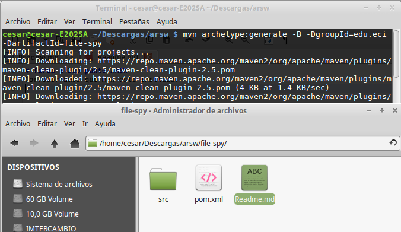
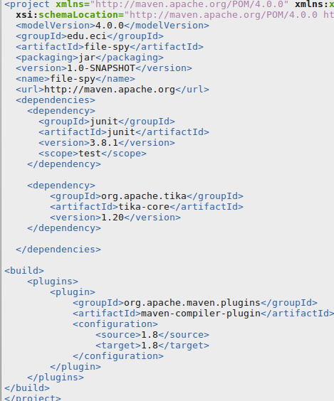

# Tarea 1 2do punto ARSW
Corroborramos que mvn este instlado.

 


Creamos el proyecto en maven.
 


Significado de comandos

Cuando se utiliza -D, Se define un sistema de propiedad.

Cuando se Utiliza -B , se ejecuta en un modo no interacitivo.


 

Las propiedades group id, y el artifactid sirven a Maven para indicar a que grupo pertenecen, y sobre que proyecto se
esta trabajando.

En el directrio creado, se tienen 3 cosas:

1. SRC : Donde se almacena el proyecto y todos sus recursos.
2. POM: Aqui se escriben todas las dependencias que el proyecto puede usar, y sirve para el momento del proyecto ser ejecutado, que maven descargue todas sus dependencias y asi la aplicacion corra.
3. Readme.md: Este documento sirve para descibir el proyecto. (fue creado por mi.).


 


Y se crean con exito las carpetas de resource tanto en src como en test.


 
 
 
 
 # Archivos POM
 
 ¿Qué significa la palabra SNAPSHOT en el valor de la versión?

 ```
Significa una version del proyecto que esta en tiempo de desarrollo. Es una especie de "Trabajo en progrseo."
EN maven es una convenion, todo lo que anteceda a ese prefijo a Maven no le va a importar.
```
¿Cuál es el propósito de la etiqueta de embalaje en el archivo POM?

 ```
Representa una version estable , unica.
```

¿Cuál es el propósito de las dependencias y las etiquetas de dependencia en el archivo POM?
 
  ```
Las etiquetas siver para identificar los diferentes dependencias de que java pueda necesitar para ser ejecutado.
```

# Dependencias

Dependencia agregada al pom.

 
 
 
 Se reeemplaza el plugin por el provsito por el taller.
 
  
  


# Ciclos de Vida

* The three principal Maven lifecycles are clean, default and site. Describe each one.
	 * clean: Se usa cuando desea eliminar los archivos generados en el momento de la compilación en el directorio de un proyecto. 
	 * default : Es una configuracion predeterminada que tiene el complemento para que pueda trabajar.
	 * site: Se utiliza para generar un sitio para el proyecto.

* Using the terminal execute the command mvn compile. Take the output screenshot. What is this command using for? What are transitive dependencies?

 

* Using the terminal execute the command mvn package. Take the output screenshot. What is this command using for?

  

* Using the terminal execute the command mvn install. Take the output screenshot. What is this command using for?

  

* Generate a new maven project in other folder using the maven command line tools, this project should has as groupId "edu.eci" and as artifactId "another-maven-project". Take the output screenshot.

  

* Replace the code of the App.java class with the following code and do all the necessary steps to compile the code.

  